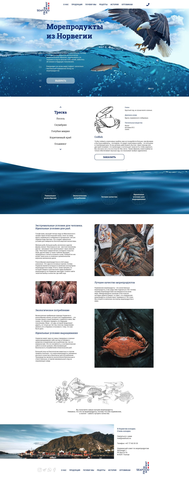

# Seafood layout flexbox

A simple [flexbox site](https://bukovski.github.io/seafood-template/index.html) layout project from the [figma layout](https://www.figma.com/file/KrDNJpoQQFnFLyuusv1vdX/%D0%BC%D0%BE%D1%80%D0%B5%D0%BF%D1%80%D0%BE%D0%B4%D1%83%D0%BA%D1%82%D1%8B)

For the dynamic work of slides, I use [jQuery](https://jquery.com/) and [Slick libraries](https://kenwheeler.github.io/slick/) 

